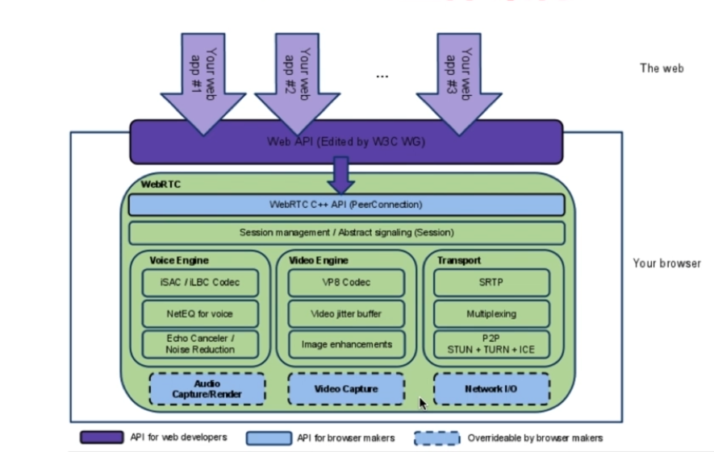
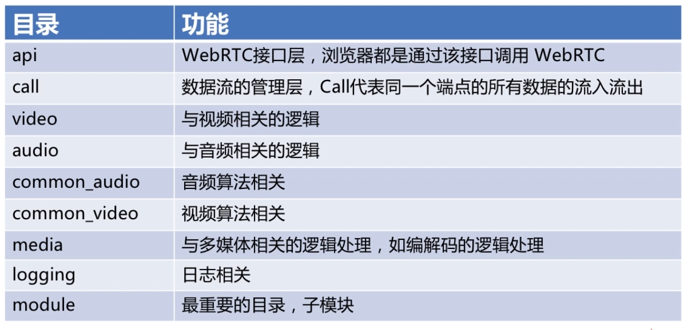
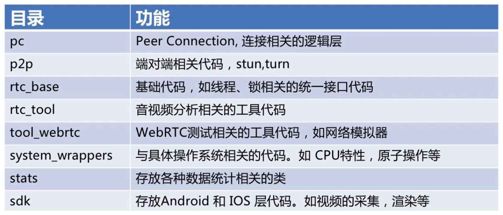
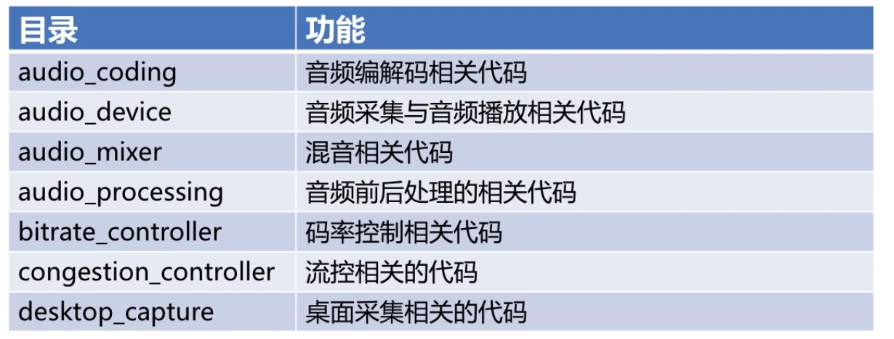
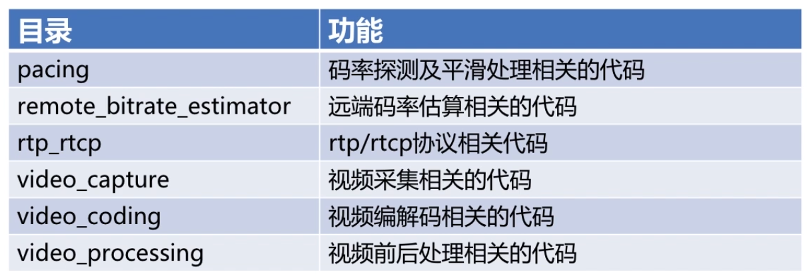
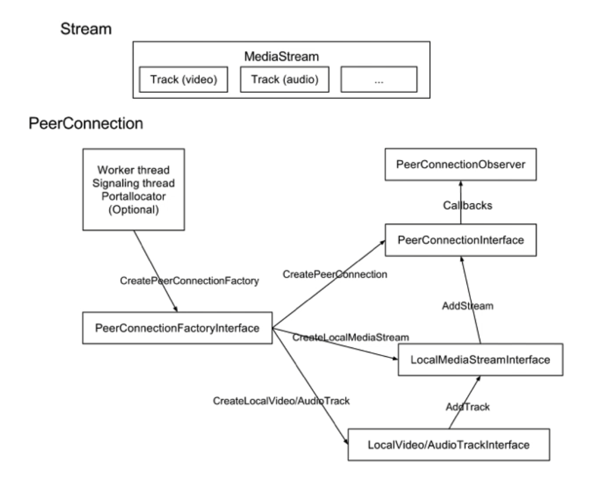
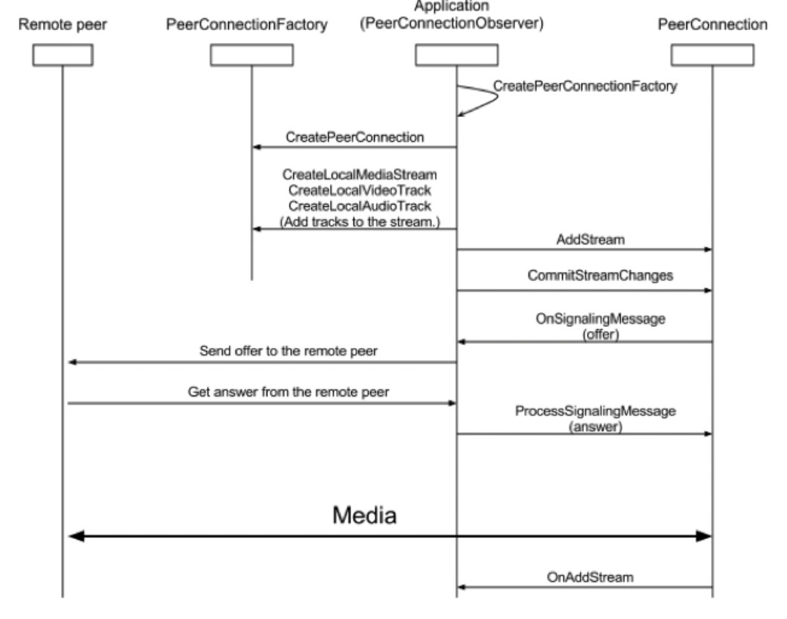

## WebRTC整体架构

## WebRTC目录结构

##  WebRTC Modules目录

## WebRTC运行机制

### 轨与流

- Track 轨 	各个轨之间保持平行
- MediaStream 流 每个流里面包括了多条轨

### WebRTC重要的类

- MediaStream
- RTCPeerConnection 
- RTCDataChannel 非音视频的数据通过这个类进行传输

### PeerConnection调用过程

### 调用时序图

