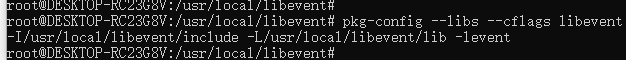

## 一、通过fork的方式实现高性能网络服务器

- 每收到一个连接就创建一个子进程
- 父进程负责接收连接
- 通过fork创建子进程

```c++
#include <iostream>

#include <unistd.h>
#include <netinet/in.h>
#include <sys/socket.h>
#include <string.h>

#define PORT 8111
#define MESSAGE_LEN 1024

int main(int argc, char* argv[])
{
    int ret = -1;
    int on = 1;
    int backlog = 10;
    pid_t pid;

    int socket_fd, accept_fd;
    struct sockaddr_in localaddr, remoteaddr;

    char in_buff[MESSAGE_LEN] = {0,};

    socket_fd = socket(AF_INET, SOCK_STREAM, 0);
    if (socket_fd == -1){
        std::cout << "Failed to create socket!" << std::endl;
        exit(-1);
    }

    ret = setsockopt(socket_fd, SOL_SOCKET, SO_REUSEADDR, &on, sizeof(on));
    if (ret == -1) {
        std::cout << "Failed to set socket options!" << std::endl;
    }

    localaddr.sin_family = AF_INET;
    localaddr.sin_port = PORT;
    localaddr.sin_addr.s_addr = INADDR_ANY;
    bzero(&(localaddr.sin_zero), 8);

    ret = bind(socket_fd, (struct sockaddr *)&localaddr, sizeof(struct
    sockaddr));
    if (ret == -1) {
        std::cout << "Failed to bind addr!" << std::endl;
        exit(-1);
    }

    ret = listen(socket_fd, backlog);
    if (ret == -1) {
        std::cout << "Failed to listen socket!" << std::endl;
        exit(-1);
    }

    for (;;) {
        socklen_t addr_len = sizeof(struct sockaddr);
        accept_fd = accept(socket_fd, (struct sockaddr *) &remoteaddr,
        &addr_len);

        pid = fork();

        if (pid == 0) {
            for (;;) {
                ret = recv(accept_fd, (void *)in_buff, MESSAGE_LEN, 0);
                if (ret == 0) {
                    break;
                }

                std::cout << "recv:" << in_buff << std::endl;
                  send(accept_fd, (void*)in_buff, MESSAGE_LEN, 0);
            }
        }
    }

    if (pid != 0) {
        close(accept_fd);
    }
    return 0;
}  
```


fork方式带来的问题

- 资源被长期占用
- 分配子进程花费时间长


## 二、通过select实现高性能网络服务器

#### 什么是异步io

异步io是指以事件触发的机制来对io操作进行处理

与多进程和多线程技术相比，异步io技术的最大优势的系统开销小，系统不必创建进程/线程，也不必维护这些进程/线程，从而大大减少了系统的开销

#### select方式实现

- 遍历文件描述符集中的所有描述符，找出有变化的描述符
- 对于监听的socket和数据处理的socket要区别对待
- socket必须设置为非阻塞方式工作

#### 重要API

```
FD_ZERO\FD_SET\FD_ISSET
```

```
flag fcntl(fd, F_SETFL/F_GETFL, flag)
```

```c++
events select(nfds, readfds, writefds, exceptfds, timeout)
```

#### select函数输入参数的意义

- 需要关注的文件描述符
- 对每个文件描述符需要关注的状态（读、写、异常）
- 要等待的时间（永远、一段时间、不等待）

#### 从select函数得到的信息

- 已经做好准备的文件描述符的个数
- 对于读、写、异常，哪些文件描述符准备好了

#### 理解select模型

- 理解select模型的关键在于理解fd_set类型
- fd_set就是多个整形字的集合，每个bit代表一个文件描述符
- FD_ZERO表示将所有位置0
- FD_SET是将fd_set中的某一位置1
- select函数执行后，系统会修改fd_set中的内容
- select函数执行后，应用层要重新设置fd_set中的内容


## 三、通过epoll实现高性能网络服务器

#### 使用epoll的好处

- 没有文件描述符的限制
- 工作效率不会随着文件描述符的增加而下降 
- epoll经过系统优化更加高效

#### epoll事件的触发模式

- 水平触发 如果没有即时处理，则反复触发
- 边缘触发 只触发一次

#### epoll重要的API

```
int epoll_create() 参数无意义，可忽略
```

```
int epoll_ctl(epfd, op, fd, struct epoll_event *event)
```

```
int epoll_wait(epfd, events, maxevents, timeout)
```

#### epoll事件

- EPOLLET	设置为边缘触发
- EPOLLIN     设置读事件
- EPOLLOUT   设置写事件

#### epoll_ctl相关操作

- EPOLL_CTL_ADD
- EPOLL_CTL_MOD
- EPOLL_CTL_DEL

#### 异步事件的惊群现象


## 四、通过I/O事件处理库来实现高性能网络服务器

#### libevent

#### libevent重要函数

- event_base_new 创建epoll实例 初始化
- event_base_dispatch 相当于epoll_wait
- event_new event_add event_del event_free
- evconnlistener_new_bind 

#### libevent编译与安装

- http://libevent.org/
- wget -c addr --no-check-certificate
- ./configure --prefix=/usr/local/libevent
- make && sudo make install
- 设置环境变量

```
unset PKG_CONFIT_LIB
export PKG_CONFIG_PATH=/usr/local/libevent/lib/pkgconfig:$PKG_CONFIG_PATH
export LD_LIBRARY_PATH=/usr/local/libevent/lib:$LD_LIBRARY_PATH
```



#### buferevent的作用

- 从外面看，它就是一个缓冲区，可以与socket绑定
- 内部由输入和输出缓冲区组成
- 每一个socket对应一个bufferevent
- 当socket有事件触发时，可以设置回调函数

