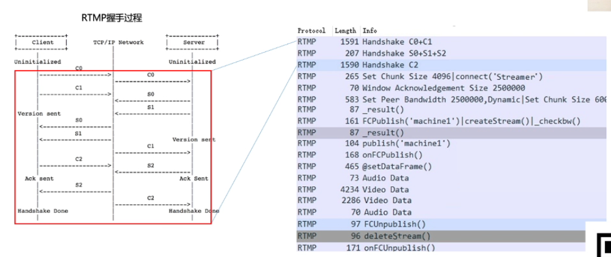
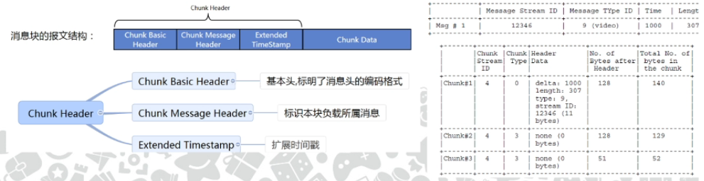

# 直播平台技术原理

## 直播相关基础知识

### 图片原始采样数据--RGB

RGB格式：每一个数据单元表示RGB三原色，用各原色其所占位数来表示

RGB888(24位色)

RGB565(16位色)

为什么RGB565要多留一位给绿色G？

人眼大约有1.2亿个视杆细胞和600万个视锥细胞。视杆细胞感知光度，视锥细胞有三种，分别对不同波长的光敏感（蓝绿红）。

视杆细胞对绿色波段最为敏感。人眼对光度的敏感度远大于颜色。

### 亮度、色度模型数据--YUV

YUV颜色空间是从RGB颜色空间推导而来。

YUV3种采样模式：444，422，420。数字表示Y、U、V三个分量的采样比。

YUV420比RGB888节约四分之三的空间

### 为什么需要视频编解码？

不考虑音频的情况下，一段1小时1080P的纯视频未编码原始数据(RGB888)大小为500G.

### 如何进行编码？

视频冗余信息

冗余信息分析--分组、分块

### 视频帧的类型

B帧不适合用于直播场景。因为没有下一帧信息。

### 帧的编码方式

对I帧的处理，是采用**帧内编码方式**，只利用本帧图像内的空间相关性。

对P帧的处理，采用**帧间编码**（运动估计和补偿），同时利用空间和时间上的相关性。

### 量化

通过用更粗糙的数据表示精细的数据来降低编码的数据量，或者通过去除人眼不敏感的信息来降低编码数据量。

### 编码过程

1.每一帧原始采样分块

2.图片分组

​	有差别的像素只有10%以内的点，亮度差值变化不超过2%，而色度差值变化只有1%以内

​	一组称为一个GOP（包括一份I帧和多份P/B帧）

3.逐帧编码

### 封装格式

### 网络传输协议

### 整体回顾

## 如何搭建一套直播系统

### 基础直播系统结构

### 客户端推流处理过程

软编码：使用CPU进行编码，通过软件代码来实现音视频编解码算法，如FFMpeg,GPUImage等。

硬编码：使用非CPU的硬件芯片或电路实现编码算法，通过调用编解码芯片提供的API来实现，如安卓的MediaCodec等。

现在的智能手机的“芯片”从严格意义上说其实已经不是单纯一个CPU，而是SoC，由CPU，GPU，DSP等芯片集成在一起。

### RTMP协议推流过程--握手

### RTMP协议推流过程--推流

### RTMP协议报文格式

RTMP协议中一块有完整意义的单位是“消息”，但一段“消息”在网上传输时被拆分成“消息块(Chunk)”，每块一般固定128字节(不含分块头)，最后一块(同一段报文的)可以小于128字节。

### 服务端处理过程

基础流媒体服务器主要包含几个功能：信令处理；视频流处理(转码、转封装、接&拉流)；视频文件存储

流媒体服务器有大量成熟解决方案（开源、商业化）：如 SRS\NGINX\CRTMPD\AMS\WOWZA等

###  整体开源解决方案

基于OBS （PC强大的采集工具）+ SRS（开源流媒体服务器）可以快速搭建一套直播模型。

## 从原型到千万DAU的直播平台

### 直播平台基础架构图

### 流媒体服务器集群

### 业务服务框架-TAF

IDL:接口定义语言JCE

RPC:同步、异步、单向

高性能：负载均衡算法、过载保护、熔断等

可伸缩：支持水平扩容

服务治理：部署、发布、扩/缩容、测试、配置中心、监控等

### 其他需要具备的能力

日志处理

链接通道

